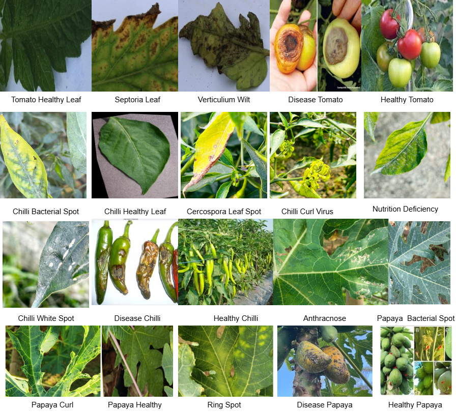

# Tomato-Chilli-Papaya (TCP) Plant Disease Dataset



The **TCP Dataset** is a multi-crop, multi-disease image repository designed for the classification of both leaf and fruit diseases. It features 9,541 images across 20 distinct classes for Tomato, Chilli, and Papaya.

## 📊 Dataset Overview
- **Total Images:** 9,541
- **Crops:** Tomato (*Solanum lycopersicum*), Chilli (*Capsicum annuum*), Papaya (*Carica papaya*)
- **Total Classes:** 20 (Healthy + Diseased)
- **Primary Source:** Field collections from Rajasthan, India (Jaipur, Kota, Bundi).

### Class Distribution
| Crop   | Classes Included | Major Diseases |
| :---   | :--- | :--- |
| **Tomato** | 5 | Septoria Leaf Spot, Verticillium Wilt |
| **Chilli** | 8 | Curl Virus, Bacterial Spot, Cercospora Spot |
| **Papaya** | 7 | Ring Spot, Anthracnose, Curl Virus |

## 🛠 Model Training Requirements

To train deep learning models (e.g., ResNet, EfficientNet, or Vision Transformers) on this dataset, the following environment is recommended:

### 1. Hardware Requirements
* **GPU:** NVIDIA GeForce RTX 3060 or higher (minimum 8GB VRAM for batch sizes of 32+).
* **RAM:** 16GB or higher.
* **Storage:** At least 10GB of free space for dataset and checkpoints.

### 2. Software & Libraries
* **Python:** 3.8+
* **Deep Learning Framework:** `PyTorch` (1.12+) or `TensorFlow` (2.10+)
* **Image Processing:** `OpenCV`, `Pillow`
* **Data Analysis:** `NumPy`, `Pandas`, `Matplotlib`, `Seaborn`

### 3. Recommended Preprocessing Pipeline
Since 55% of the data is field-captured with complex backgrounds, the following steps are crucial:
* **Resizing:** Resize images to $224 \times 224$ or $256 \times 256$ pixels.
* **Normalization:** Use Mean/Std normalization (e.g., ImageNet constants: `mean=[0.485, 0.456, 0.406]`).
* **Augmentation:** To combat the "natural imbalance" noted in the dataset, apply:
    * Horizontal/Vertical Flips
    * Random Rotation ($\pm 30^{\circ}$)
    * Brightness and Contrast adjustments (to handle varying field illumination).

## 🚀 Getting Started
```python
# Example: Loading the TCP Dataset in PyTorch
from torchvision import datasets, transforms

data_transform = transforms.Compose([
    transforms.Resize((224, 224)),
    transforms.ToTensor(),
    transforms.Normalize([0.485, 0.456, 0.406], [0.229, 0.224, 0.225])
])

dataset = datasets.ImageFolder(root='path/to/TCP_dataset', transform=data_transform)


---

## ⚙️ Deep Learning Training Strategy

Given the characteristics of the TCP dataset, here is how you should approach model training:

### Handling Class Imbalance
The dataset contains a "strong disease-focused bias" (6,461 diseased vs. 3,080 healthy). However, specific classes like *Disease Tomato* (209 images) are much smaller than *Septoria Leaf Spot* (1617 images).
* **Loss Function:** Use `WeightedCrossEntropyLoss` to give higher importance to the minority classes.
* **Sampling:** Implement a `WeightedRandomSampler` in your Data Loader.

### Model Selection
* **Mobile-Friendly:** If the goal is a farmer-facing app, use **MobileNetV3** or **EfficientNet-B0**.
* **High Accuracy:** For research benchmarks, use **ResNet-50** or **Vision Transformer (ViT)** to capture the fine-grained features of lesions and chlorosis.

### Metrics
Since the dataset is imbalanced, **Accuracy** alone is misleading. You must track:
1.  **F1-Score:** The harmonic mean of precision and recall.
2.  **Confusion Matrix:** Specifically to see if the model confuses different types of "Leaf Spots" across crops.

**Would you like me to generate a specific Python script for training a ResNet model on this TCP data?**
